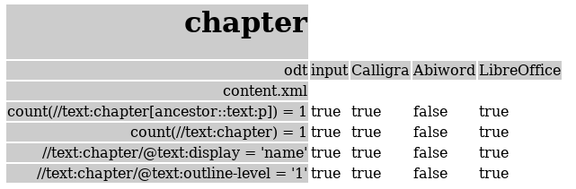

# Introduction to ODFAutoTests

You probably know that OpenDocument Format files come in a number of forms: text, presentation, spreadsheet, drawings and more. Since ODF is a standard, ODF files should look and behave similarly in all the software that supports ODF. ODFAutoTests is here to help users and developers to write test documents for ODF software. Tests are a great tool to help software and standards mature. Because tests are so important, ODFAutoTests makes it easy to create them.

ODFAutoTests can help you create different types of tests. This introduction demonstrates the advantage of ODFAutoTests with a simple example.

Let's say we want to write a test for the [`<text:chapter/>` element](http://docs.oasis-open.org/office/v1.2/os/OpenDocument-v1.2-os-part1.html#__RefHeading__1415316_253892949). This element inserts the name and/or the number of the current chapter into your text. Here is a simple ODF fragment that uses `<text:chapter/>`:

```xml
<office:text>
  <text:h text:outline-level="1">Introduction</text:h>
  <text:p>
    <text:chapter text:display="name" text:outline-level="1"/>
  </text:p>
</office:text>

```

In LibreOffice, a document with that fragment will look like this:


ODFAutoTools helps you to create a complete document from just a fragment. Creating an ODT document from a fragment is normally quite a bit of work. An ODT file, like any ODF file, is a ZIP file with contents like this:

```
Archive:  chapter.odt
  Length      Date    Time    Name
---------  ---------- -----   ----
       39  11-24-2014 21:45   mimetype
      641  11-24-2014 21:45   META-INF/manifest.xml
      365  11-24-2014 21:45   content.xml
      806  11-24-2014 21:45   styles.xml
      215  11-24-2014 21:45   meta.xml
      219  11-24-2014 21:45   settings.xml
---------                     -------
     2285                     6 files
``` 

## What ODFAutoTests does

With ODFAutoTests, you do not need to create a ZIP with all those XML files yourself. ODFAutoTests does that for you. To do so, it needs a bit more information, like what version of ODF you want, what the name of the file should be etc. We will get to that a bit later. In fact, ODFAutoTools does quite a bit more for you. In this example it will:

 1. Create `chapter.odt` from a short fragment,
 2. Validate the created file,
 3. Open `chapter.odt` in the office suites you tell it to (see below) and save it again
 4. Validate the saved files
 5. Run simple checks that you write (see below)

## Writing a test

Let's say we want to create a file called `chapter.odt` and run it through Calligra, LibreOffice and Abiword. We're in luck, because the default configuration uses those three programs.

We want to add a few checks that ODFAutoTools should perform. When a program loads and saves `chapter.odt`, the element `<text:chapter/>` should still be present in the new document. The attributes should also still be the same. In the complete test input you can see how we tell ODFAutoTools to perform those checks.

```xml
<?xml version="1.0" encoding="UTF-8"?>
<documenttests ➀
	xmlns:office="urn:oasis:names:tc:opendocument:xmlns:office:1.0"
	xmlns:text="urn:oasis:names:tc:opendocument:xmlns:text:1.0"
	xmlns="http://www.example.org/documenttests"
    xmlns:xsi="http://www.w3.org/2001/XMLSchema-instance"
	xsi:schemaLocation="http://www.example.org/documenttests documenttests.xsd"
    inputVersion="1.2" odftype="text" ➁
  >
  <test name="chapter"> ➂
    <input> ➃
      <office:text>
        <text:h text:outline-level="1">Introduction</text:h>
        <text:p>
          <text:chapter text:display="name" text:outline-level="1"/>
        </text:p>
      </office:text>
    </input>
    <output type="zip"> ➄
      <file path="content.xml">
        <xpath expr="count(//text:chapter[ancestor::text:p]) = 1"/> ➅
        <xpath expr="count(//text:chapter) = 1"/>                ➆
        <xpath expr="//text:chapter/@text:display = 'name'"/>    ➇
        <xpath expr="//text:chapter/@text:outline-level = '1'"/> ➈
      </file>
    </output>
  </test>
</documenttests>
```
This test contains a number of parts:
```
 ➀. The document element <documenttests/> can contain multiple tests
 ➁. The created document should be an ODF 1.2 text document
 ➂. The name of the test is 'chapter'
 ➃. The fragment from which the document is created
 ➄. The ODF programs should save the document back in the usual ZIP format (PDF is also possible)
 ➅. After loading and saving, there should still be one <text:chapter/> in a paragraph
 ➆  And there should be only one <text:chapter/> in the whole of `content.xml`
 ➇  The attribute 'text:display' should still have value 'name'
 ➈  And the attribute 'text:outline-level' should still have the value '1'
```

## Performing the test

So now we have the complete test, which we save as `chapter.xml`. This test is run through ODFAutoTests like this:
```
java -jar odftester.jar -t chapter.xml -i input -r output -c config.xml
```
Which results in these files:
```
input/chapter.odt
output/Calligra/chapter.odt
output/Abiword/chapter.odt
output/LibreOffice/chapter.odt
report.html
report.xml
```

## Conclusion

The results for all tests can be viewed in `result.html`:



As you can see, the input file passes all the checks. For the output files, the result is mixed. Calligra and LibreOffice properly save the `<text:chapter/>` element back, but sadly, AbiWord, does not keep it. Figuring this out without ODFAutoTests would be a lot more work.

So what is next?  Suppose that you would like the AbiWord developers to know about this deficiency, so they can fix it. The file `input/chapter.odt` is exactly the simple type if file that is ideal for adding to a bug report of feature request. At less than 2 kilobytes it is very small and contains the essentials.

### Compilation

The file `odftester.jar` can be created by compiling the source code with `ant`:

```
ant jar
```

### Usage

```
usage: java -jar odftester.jar [-c <arg>] -i <arg> -r <arg> -t <arg>
 -c,--run-config <arg>   xml file that contains the instructions for running the
                         loading and saving of the documents in the various ODF
                         implementations. If this option is absent, the files
                         will not be loaded and saved, but the files from
                         results-dir will be analyzed into a report
 -i,--input-dir <arg>    the directory for the documents that are generated from
                         the test definition
 -r,--result-dir <arg>   the directory for the results of the loading and saving
                         of the files from input-dir
 -t,--tests <arg>        xml file that contains the tests
```

